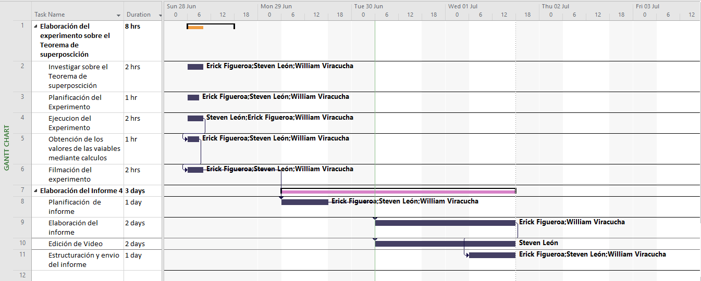

# PRÁCTICA DE LABORATORIO N° 4.

# ANÁLISIS DE MALLAS

**Autores:** León Jiphson, Figueroa Erick, Viracucha William.

# 1. PLANTEAMIENTO DEL PROBLEMA

# 2. OBJETIVOS

- Comprobar experimentalmente el análisis de mallas
- Analizar y evaluar la Ley de Voltaje de Kirchhoff en mallas afectadas por dos fuentes de voltaje.

# 3. MARCO TEÓRICO

Las Leyes de Kirchhoff están basadas en dos leyes fundamentales en la ciencia, la Ley de Conservación de la Carga y la Ley de conservación de la Energía, de esta forma Gustav Kirchhoff en 1848 plantea sus leyes entre ellas tenemos a la Ley de Voltaje de Kirchhoff, la cual postula _En un camino cerrada la suma de las subidas de tensión es igual a la suma de las caídas de tensión,_ sin embargo, esta ley se complementa con la Ley de Ohm, teniendo una relación adecuada que relacione la tensión y la intensidad.

Dentro del análisis de circuitos usando la Ley de Voltaje de Kirchhoff se usa el método de nodo de voltaje dentro del cuál podemos encontrar tres tipos diferentes de variaciones o variables.

- Resistencia y fuentes de corriente independiente.
- Resistencia y fuentes de corriente y voltajes independientes.
- Resistencia y fuentes de voltaje dependientes

Al analizar un circuito encontramos que los voltajes llegan a variar dependiendo de la cantidad de elementos presentes en un circuito, de igual forma se encuentra una corriente circulando por una linea que conecta los terminales de los elementos del circuito, esta corriente es utilizada en el análisis de mallas con la Ley de voltajes de Kirchhoff, ya que se recomienda seguir 3 pasos para el análisis del circuito y la obtención de los valores de voltaje y corriente.

- **1.** Identificar las mallas en el circuito.
- **2.** Idealizar la corriente que circula por la malla y el sentido de la misma, se recomienda el sentido positivo para todas las corrientes.
- **3.** Aplicar la Ley de Voltaje de Kirchhoff realizando la sumatoria de las tensiones, usar la ley de Ohm para las relaciones de voltaje-corriente, y realizar el sistema de ecuaciones con las n incógnitas presentadas según el número de mallas.

Por otro lado, existen circuitos que contienen más de una fuente, y mallas que no tienen una fuente pero, que circula una corriente por sus lineas.

# 4. DIAGRAMAS

# 5. LISTA DE COMPONENTES

# 6. CONCLUSIONES

# 7. RECOMENDACIONES

# 8. CRONOGRAMA 

# 9. BIBLIOGRAFÍA

- http://www.ecorfan.org/bolivia/researchjournals/Tecnologia_e_innovacion/vol4num13/Revista_de_Tecnologia_e_Innovacion_V4_N13_5.pdf
- http://wwwprof.uniandes.edu.co/~ant-sala/cursos/FDC/Contenidos/02_Leyes_de_Voltajes_y_Corrientes_de_Kirchhoffs.pdf

# 10. ANEXOS

- https://github.com/leonsteven2/Pr-ctica-N-2/blob/master/Anexos/C%C3%A1lculos%20Anal%C3%ADticos.pdf
